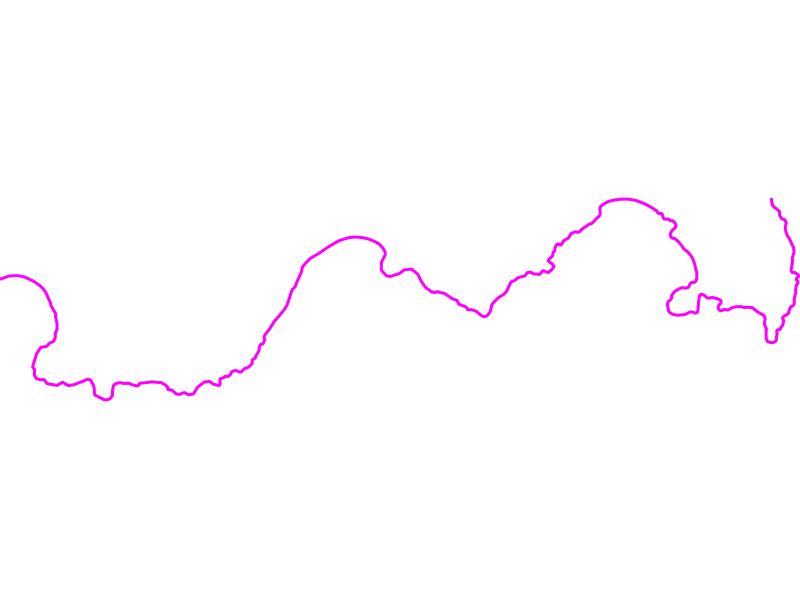

# Create Mapfile
## Map
First off, we start with a Mapfile.

## Mapfile
```
MAP
  NAME "wellington-nz-coastlines"
  EXTENT        6289755.442237 -3805984.513519 6292696.369653 -3805245.394890
  UNITS         DD
  SIZE          800 600

  IMAGETYPE     PNG

  PROJECTION
        "init=epsg:3857"
  END
END
```

### Extent
This provides the bounding box for EXTENT in the Mapfile.

```
Extent: (6289755.442237, -3805984.513519) - (6292696.369653, -3805245.394890)
```
### Projection
The majority of tiles provider on leaflet use _epsg:3857_ to rasterize their tiles.

```
PROJECTION
      "init=epsg:3857"
END
```

## Layer
Get the names of the layers from the database.

```bash
$ ogrinfo PG:"host=localhost user=example password=password dbname=exampledb port=5432"
```

The command above should return something like.

```
INFO: Open of `PG:host=localhost user=user password=password dbname=exampledb port=5432'
      using driver `PostgreSQL' successful.
1: nz-coastlines-topo-150 (Multi Line String)
```

Get the information for the needed for the mapfile.

```bash
$ ogrinfo PG:"host=localhost user=example password=password dbname=exampledb port=5432" nz-coastlines-topo-150 -summary
```

The command above returns something similar to the following:

```
INFO: Open of `PG:host=localhost user=example password=password dbname=exampledb port=5432'
      using driver `PostgreSQL' successful.

Layer name: nz-coastlines-topo-150
Geometry: Multi Line String
Feature Count: 1
Extent: (6289755.442237, -3805984.513519) - (6292696.369653, -3805245.394890)
Layer SRS WKT:
(unknown)
FID Column = gid
Geometry Column = geom
t50_fid: Integer (0.0)
elevation: Integer (0.0)
```
### Layer name
The table name to query the database for. it retrieves the LAYER.
```
Layer name: nz-coastlines-topo-150
```

### Geometry
A _Multi Line String_ refers to the TYPE _Line_ in a Mapfile
```
Geometry: Multi Line String

```

Then we can create add a LAYER to the Mapfile:

```
LAYER
  NAME "coastlines"
  TYPE Line
  STATUS ON
  CONNECTIONTYPE POSTGIS
  CONNECTION "dbname=solidwaffle host=localhost port=5432 user=woodj password=1234"
  PROCESSING "CLOSE_CONNECTION=DEFER"
  DATA 'geom from "public"."nz-coastlines-topo-150k" using srid=3994 using unique gid'

  CLASS
    STYLE
        COLOR "#FF00FF"
        WIDTH 3.0
      END
   END

   METADATA
     wms_title "coastlines"
   END
END
```

### Data
The USING _srid_ and _unique_ improve performance for database queries.
```bash
DATA 'geom from "public"."nz-coastlines-topo-150k" using srid=3994 using unique gid'
```

### CLOSE_CONNECTION
Good practise, improves performance if multiple connections are being established.

```
PROCESSING "CLOSE_CONNECTION=DEFER"
```

_N.B. No my password is not 1234, nice try!_

## Web
This following code adds WFS and WMS capabilities connections to the Mapfile.

```
WEB
  IMAGEPATH "/ms4w/tmp/ms_tmp/"
  IMAGEURL "/ms_tmp/"
  METADATA
    wms_title          "wellington-nz-coastlines"
    wms_format         "PNG"
    wms_server_version "1.1.1"
    wms_srs            "EPSG:3857"
    wms_onlineresource "http://localhost/cgi-bin/mapserv?map=/home/woodj/Documents/solid-waffle/src/mapfile/nz-coastlines-topo.map&"
    wms_abstract       "A map of the Wellington Coastline NZ."
    wms_enable_request "*"

    wfs_title          "wellington-nz-coastlines"
    wfs_format         "PNG"
    wfs_onlineresource "http://localhost/cgi-bin/mapserv?map=/home/woodj/Documents/solid-waffle/src/mapfile/nz-coastlines-topo.map&"
    wfs_srs            "EPSG:3857"
    wfs_abstract       "A map of the Wellington Coastline NZ."
    wfs_enable_request "*"
  END
END
```

### SRS
Most tile providers use EPSG:3857 to rasterize their layers by default.
'''map
wms_srs            "EPSG:3857"
'''

### Enable request
Be default all requests are disabled, the asterisks _*_ enables all requests

```
wms_enable_request "*"
```

## Mapserver

### Render the mapfile
The following URL queries the Mapfile through the WMS service.

```
http://localhost/cgi-bin/mapserv?map=/home/woodj/Documents/solid-waffle/src/mapfile/nz-coastlines-topo.map&SERVICE=WMS&REQUEST=Getmap&VERSION=1.1.1&LAYERS=Coastlines&SRS=EPSG:3857&BBOX=6289755.442237,-3805984.513519,6292696.369653,-3805245.394890&FORMAT=PNG&WIDTH=800&HEIGHT=600
```

### Quick Test: shp2img
The following command generates an image from the Mapfile:
```bash
shp2img -m nz-coastlines-topo.map nz-coastlines-topo.png
```
It can be used to quickly test that the Mapfile is working



### Full test: capabilites
This url will retrieve the capabilities of the mapfile.

```
http://localhost/cgi-bin/mapserv?map=/home/woodj/Documents/solid-waffle/src/mapfile/nz-coastlines-topo.map&SERVICE=WMS&REQUEST=getcapabilities&VERSION=1.1.1
```
The command returns the capabilities of the Mapfile for WMS as an XML document.

It is important to check this document for WARNINGS about the Mapfile.
